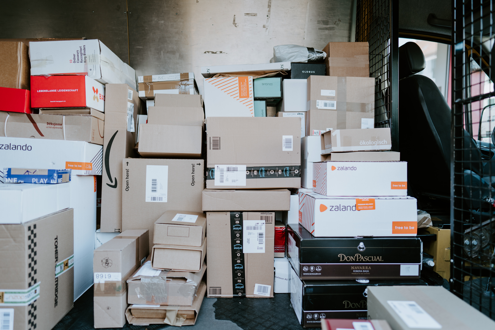
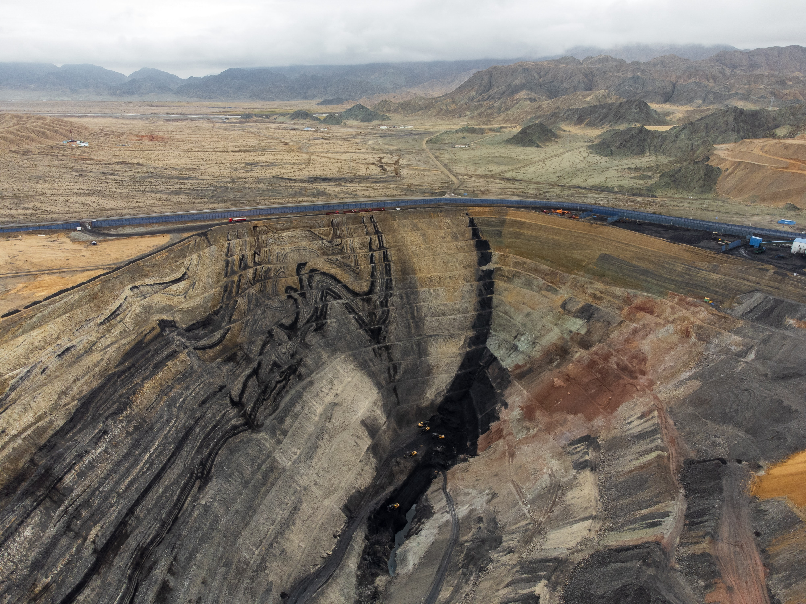
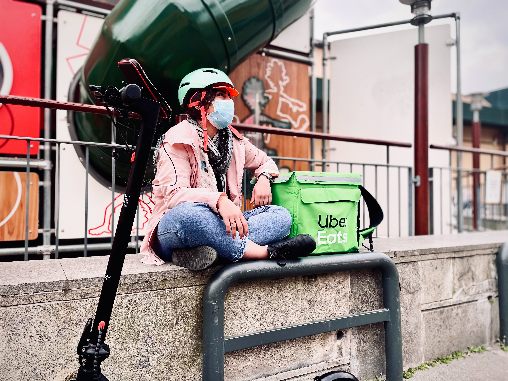
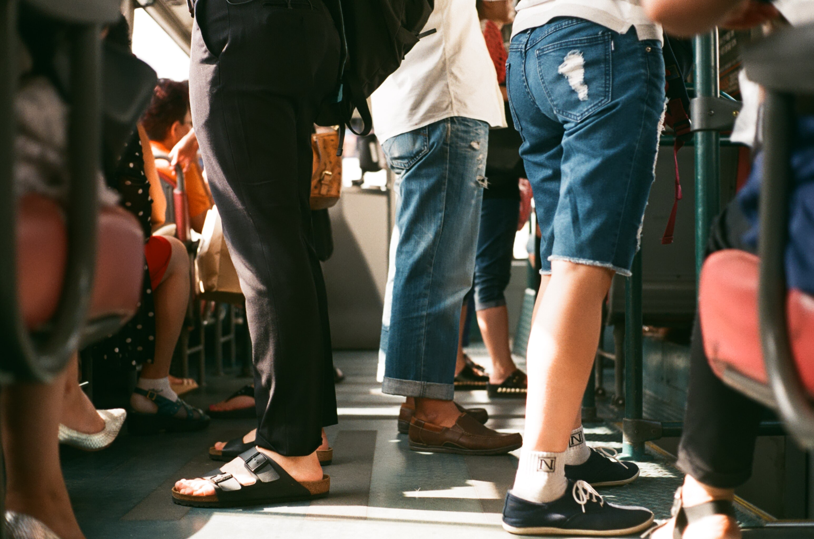
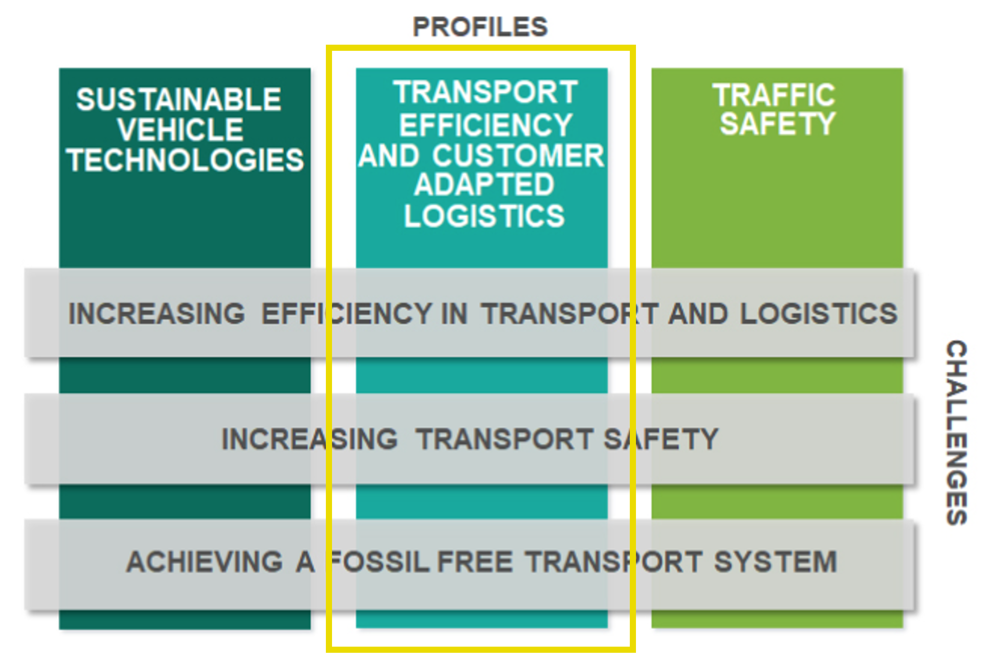

```{r child = "setup.Rmd"}
```

```{r xaringan-logo, echo=FALSE}
#xaringanExtra::use_logo(image_url = "img/Image2.png")
```

```{r echo=FALSE}
xaringanExtra::use_panelset()
```


class: middle
background-image: url(img/imagem3.png)
background-size: contain

.huge[
.center[
Why should you become a Master's student at Chalmers?
]]

.purple[
.large[
**Lecture for the position "Assistant Professor progressing the transition to future transport solutions"**
]]


.purple[
Renata Oliveira   
25/05/2022
]

---
class: inverse, center, middle
background-image: url(img/fundo1.png)
background-size: cover

.center[
# What challenges do you and your city face on a daily basis?
]

---

class: middle
background-image: url(img/fundo2.png)
background-size: cover

.panelset.sideways[

.panel[.panel-name[Inequality]
### Urban and Regional Challenges
```{r echo=FALSE, out.width="80%"}
knitr::include_graphics("img/elyse-chia-kyeJW1zRH0I-unsplash.jpg")
```

]

.panel[.panel-name[Bad weather and commuting]
### Urban and Regional Challenges
```{r echo=FALSE, out.width="80%"}

```

]
.panel[.panel-name[Unwalkable neighborhoods]
### Urban and Regional Challenges
```{r echo=FALSE, out.width="70%"}
knitr::include_graphics("img/reid-zura-nIY23aGkY0s-unsplash.jpg")
```

]
.panel[.panel-name[Delivery delays]

### Urban and Regional Challenges

```{r echo=FALSE, out.width="80%"}

```

]
.panel[.panel-name[Air and noise pollution]
### Urban and Regional Challenges
```{r echo=FALSE, out.width="80%"}

```

]
.panel[.panel-name[Limited resources]
### Urban and Regional Challenges
```{r echo=FALSE, out.width="70%"}

```

]

.panel[.panel-name[Security issues]
### Urban and Regional Challenges
```{r echo=FALSE, out.width="80%"}
knitr::include_graphics("img/c-joyful-uWOBgtCD_m8-unsplash.jpg")
```

]

.panel[.panel-name[Cold meals]
### Urban and Regional Challenges
```{r echo=FALSE, out.width="70%"}

```

]

.panel[.panel-name[Crowded public transportation]
### Urban and Regional Challenges
```{r echo=FALSE, out.width="80%"}

```
]

.panel[.panel-name[Disbalance between demand and supply]
### Urban and Regional Challenges
```{r echo=FALSE, out.width="80%"}
knitr::include_graphics("img/wesley-tingey-DBu9IrkuPFM-unsplash.jpg")
```
]
]


???

Maybe you haven't experienced all theses situations, but you surely know what it is about and how it affect people's lives. 

Mobility of people and availability of goods is a fundamental part of the modern society and generates tremendous economic and social value. However, growing transport volumes pose challenges such as climate change, environmental pollution and traffic accidents.


---

class: center
background-image: url(img/fundo2.png)
background-size: cover

## The vision of a sustainable future is what drives Chalmers


```{r echo=FALSE, out.width="60%"}
knitr::include_graphics("img/together.jpg")
```


???

To achieve this vision, besides departments of education, Chalmers has organized students, researchers and professors in areas of advance. Areas of Advance are all about interdisciplinarity, interaction between people; between researchers within and outside Chalmers, between researchers and students at Chalmers, between Chalmers and the surrounding world. 


---

background-image: url(img/fundo2.png)
background-size: cover

## Areas of Advance

.large[
- Energy   
- Health Engineering   
- Information and Communication Technology   
- Materials Science   
- Nano   
- Production     
- .bold[TRANSPORT]
]

???

The Areas of Advance are organised as strong, challengedriven thematic platforms for strategy and long-term collaboration that hunt down specific challenges, often directly relevant for industry and society. They also offer common access to cutting-edge research infrastructures as well as to several targeted centres. At the same time, our departments represent a continuous source of expertise. And it is this, the interplay between the departments and the Areas of Advance, that is so instrumental to our success, mobilizing all aspects of our operations.

Creates new knowledge to meet transport-related sustainability challenges. Current themes are autonomous transport, electromobility and the transition to future transport systems.

---

background-image: url(img/fundo2.png)
background-size: cover

## Transport Area of Advance

### Among other goals.... 

.large[
- Create the potential for sustainable and safe transport systems   
- Increase effectiveness and efficiency   
- Enhance livability, equitable access to opportunities and quality of life   
- Address social, environmental and economic challenges   
]

---

background-image: url(img/fundo2.png)
background-size: cover

## Transport Area of Advance

.large[
.center[
**Transport Efficiency and Customer Adapted Logistics** 
]]

```{r echo=FALSE, out.width="65%"}

```


???

To explore these goals through research and education, our research group focus on Transport Efficiency and Customer Adapted Logistics

Interdisciplinarity


---

background-image: url(img/fundo2.png)
background-size: cover

## Sustainable Development Goals set - UN
 
Try to put your research in a broader context and explain why it is relevant and important. Give examples of what a master thesis in this area might enable the students to do in the future and try to share your enthusiasm about the subject.

???

So, we address these Sustainable Development Goals: 

---
background-image: url(img/fundo2.png)
background-size: cover

- Production and consumption in local scale

- 
---
background-image: url(img/fundo2.png)
background-size: cover

# Department of Architecture and Civil Engineering
## Architecture and planning beyond sustainability, MSc
## Architecture and urban design, MSc

Creates the architects and civil engineers of the future, through education and research. Looking at engineering and social science, architecture and humanities, for the benefit of a sustainable society.

he education leads to a wide range of career opportunities within architecture, urban design, and planning for sustainable development as a response to increasing awareness and commitment among both public and private actors.
A master’s degree in architecture and urban design offers a wide range of career opportunities, from practice to research. Most of our courses have a strong connection and collaboration with industry and real projects. 
Graduates work in architecture and urban design offices, city planning offices, and governmental bodies.

---
Computer Science and Engineering
The Department of Computer Science and Engineering (abbreviated CSE) has close to 300 employees who are engaged in education and research in a wide range of disciplines and areas of expertise from basic research to applications. We educate for the future and create social benefits through our research that is brought to life and implemented in close cooperation with business and industry. Our operations has a strong international character. The department is joint between Chalmers and University of Gothenburg.

Most of the research at Data Science and AI is in cooperation with partners in academia and industry, which is combined with basic research in machine learning and related areas:
algorithm theory (design, complexity, randomness)
optimization and operations research (scheduling, routing)
theoretical ML research (learning, decision-making)
health informatics, bioinformatics and computational biology
natural language processing (text analysis, representation learning, multimodality)
autonomous vehicles
mathematical modelling and problem solving 

Interaction Design and Software Engineering
Interaction Design concerns the interaction between people and products in which information technology is a central component. This can, for instance, be the interface and gameplay of modern computer games, the design of the complex interface between the driver and the network of computers controlling a modern car, the next generation of mobile communication devices or the integration of computational technology into our everyday things, such as "intelligent clothes". Regardless of application area, a design perspective on the interaction between people and technology is central. This makes interaction design an increasingly important area in application and systems development, as well as in industrial and product design.


---
Technology Management and Economics
The department conducts outstanding research within Innovation and Entrepreneurship, Operations and Supply Chain Management, Environmental Assessment and Transition Studies, and the role of Technology in Society. The department has six research divisions, one division for support functions and hosts three research centres. Our work is related to most of Chalmers' Areas of Advance.

---
The vision of a sustainable future is what drives Chalmers.

Chalmers’ Areas of Advance are all about interaction between people; between researchers within and outside Chalmers, between researchers and students at Chalmers, between Chalmers and the surrounding world. 


---

background-image: url(img/fundo2.png)
background-size: cover

# Research projects


---

background-image: url(img/fundo2.png)
background-size: cover

# Learning foundations and competence acquisition


---

background-image: url(img/fundo2.png)
background-size: cover


.bold[
.large[
Análise Espacial dos Preços de Produtos Alimentícios no Varejo de Belo Horizonte e sua relação com a renda média da população   
Orientação: *Alexandre Magno Alves Diniz*

]]

.center[
.larger[
.pink[
Acessibilidade
]]]

---

# 2017 - 2021

.bold[
Programa de mestrado em Geotecnia e Transportes da UFMG   
]

.midi[
-   Clarissa Pontes Melo - Análise da macroacessibilidade de pedestres idosos sob a ótica da qualidade do espaço urbano. 2021.

-   André Augusto Cunha Libânio - Avaliação da acessibilidade em cidades brasileiras. 2020.

-   Paulo Henrique Góes Pinto - Identificação e qualificação de centralidades urbanas por meio de estrutura morfológico-funcional: um estudo de caso para a RMBH. 2020.

-   José Moreira Gonçalves - Atração de Viagens de Carga em Indústria Automobilística de Máquinas Agrícolas e Rodoviárias. 2019.

-   Gabriela Pereira Lopes - Uma Análise da Localização de Instalações Logísticas versus Geração de Viagens e os Impactos na mobilidade urbana em Belo Horizonte. 2018.
]


---


.pull-left[
.bold[
.larger[
2017...   
Pesquisa
]]

.bold[
.midi[
Translog City   

NIUMAR - Network on Intelligent Urban Mobility and Accessibility research ❤️   

PLACES - Planning for Access ❤️  

NOSS - Núcleo de Estudos Organizacionais e Sociedade e Subjetividade ❤️  
]]
]

.pull-right[
    ```{r niumar, echo=FALSE, fig.cap="2o Workshop da NIUMAR", out.width="100%"}
    knitr::include_graphics("img/niumar.jpg")
    ```
]


---

# 2020 ...


.bold[
Programa de mestrado Administração do CEFET-MG
]

*Processos e sistemas decisórios em arranjos organizacionais*

-  Sofia Eleutério - trabalho sobre o processo decisório quanto à implementação de faixas exclusivas de ônibus como política pública.
- Felipe - caracterização da atividade e políticas públicas para vendedores ambulantes em BH   
- Fernando - Redes sociais para analisar a relação entre filiação partidária e cargos comissionados no governo federal

Colegiado do PPGA


---

.bold[
.larger[
2018 ...    
Internacionalização
]]

.midi[
4th VREF Conference. Relationships among urban characteristics, real estate market and spatial patterns of warehouses in different geographic contexts. 2021.

11th International Conference on City Logistics. EXPLORATORY ANALYSIS OF THE ACCESSIBILITY TO FOOD RETAILERS IN BELO HORIZONTE. 2019. 

15th biannual NECTAR Conference. ACCESSIBILITY TO FOOD SYSTEMS IN BELO HORIZONTE, BRAZIL. 2019. ❤️

6th workshop NIUMAR. Projects under development and research agenda. 2019. ❤️
]

---

.bold[
.larger[
2018 ...    
Internacionalização
]]

.midi[

1st Brazilian EMI. 2018.

3rd workshop NIUMAR. Perspectivas de parceria. 2018. ❤️

4th workshop NIUMAR. Encaminhamentos. 2018. ❤️

Workshop do Cluster 2 do Nectar. A sustainable business model for urban farming based on city logistics concepts for local production and consumption of vegetables. 2018. ❤️


]

---


.bold[
.larger[
2018 ...    
Internacionalização
]]

.midi[
Efficiency in Urban Logistics: Current challenges, innovative & green solutions. 2017.

Researchers Links Workshop: How the Railways contribute to improving quality of life?. Researchers Links Workshop. 2017. ❤️

2nd workshop da NIUMAR. Desenvolvimento de pesquisa. 2018. (Seminário). ❤️

Semana Internacional de Engenharia Metroferroviária, Transportes e Logística. Análise espacial aplicada a soluções para o último quilômetro. 2017.


]

---
.bold[
.larger[
2018 ...    
Internacionalização
]]

.midi[


Tenth International Conference on City Logistics. Urban Distribution of Craft-Brewed Beer in Belo Horizonte Metropolitan Area. 2017.

Cyprien Legros   
Jonathan Reith   
Joanna Wilkolek   
Neda Marjanovic   
]

---

.bold[
.larger[
2020 - 2021    
Pós-doutorado remoto
]]

.bold[
.large[
Relationships among urban characteristics, real estate market and spatial patterns of warehouses in different geographic contexts.
]]

Logistics City Chair, da Université Gustave Eiffel   
*Laetitia Dablanc*  


---

class: bottom, center
background-image: url(img/SMILE.jpg)
background-size: cover

.larger[
We have scheduled: 
- Campi visit
- Talk to students
]

---
class: middle, center, inverse
background-image: url(img/fundo2.png)
background-size: cover

```{r echo=FALSE, message=FALSE, warning=FALSE, out.width="90%"}

```

---


SDG 9 - Industry, innovation and infrastructure
Redefining urban development strategies for effective and efficient future mobility solutions.
Investigating the role of new technology for making goods transport more efficient.

SDG 11 - Sustainable cities and communities   

Virtual multimodal infrastructure for smart cities, providing more reliable and responsive transportation services, and thus improving the lives of urban dwellers.
Development of an electrical ferry, contributing to reduced pollution in cities.
A common framework of concepts and methods to investigate how sustainable modes of individual, non-motorized and collective motorized mobility have come into conflict with modern car-dominated urban city planning and traffic engineering.
Enabling cities/municipalities to evaluate the different scenarios of a mixed vehicular traffic and their impact on traffic safety and efficiency.
Researching the transition to sustainable business practices for retailing and transport as well as to sustainable consumer behaviour.


---

class: middle
background-image: url(img/fundo1.png)
background-size: contain

.large[
.yellow[
[Lattes](http://lattes.cnpq.br/2642488704355833)

[Orcid](https://orcid.org/0000-0002-9011-2342)

[Google Scholar](https://scholar.google.com/citations?user=V6EX45EAAAAJ)

[CV](https://github.com/retaoliveira/relements/raw/main/texto/index.pdf)
]]

.larger[
.center[
JOIN US!
]]
