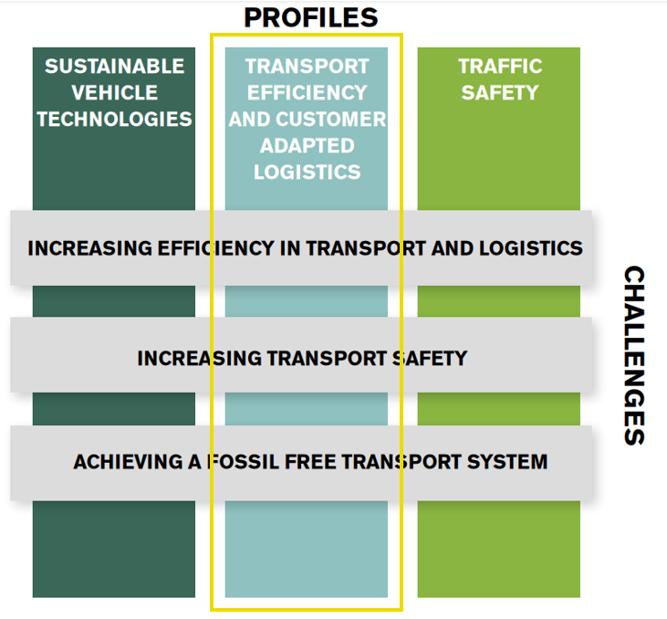
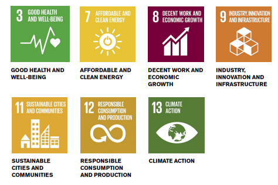

```{r child = "setup.Rmd"}
```

```{r xaringan-logo, echo=FALSE}
#xaringanExtra::use_logo(image_url = "img/Image2.png")
```

```{r echo=FALSE}
xaringanExtra::use_panelset()
```


class: middle
background-image: url(img/imagem3.png)
background-size: contain

.huge[
.center[
Why should you work in our research group to develop your thesis?
]]

.purple[
.large[
**Lecture for the position "Assistant Professor progressing the transition to future transport solutions"**
]]


.purple[
Renata Oliveira   
25/05/2022
]

???


Try to put your research in a broader context and explain why it is relevant and important. Give examples of what a master thesis in this area might enable the students to do in the future and try to share your enthusiasm about the subject.


---
class: inverse, center, middle
background-image: url(img/fundo1.png)
background-size: cover

.center[
# What challenges do you and your city face on a daily basis?
]

---

class: middle
background-image: url(img/fundo2.png)
background-size: cover

.panelset.sideways[

.panel[.panel-name[Inequities in access]
### Inequities in relation in access 
```{r echo=FALSE, out.width="80%"}
knitr::include_graphics("img/elyse-chia-kyeJW1zRH0I-unsplash.jpg")
```

]

.panel[.panel-name[Hard commuting]
### Hard commuting
```{r echo=FALSE, out.width="80%"}
knitr::include_graphics("img/nikita-ignatev-uw5y4BdHgOA-unsplash.jpg")
```

]
.panel[.panel-name[Unwalkable neighborhoods]
### Unwalkable neighborhoods
```{r echo=FALSE, out.width="70%"}

```

]
.panel[.panel-name[Delivery delays]
### Delivery delays
```{r echo=FALSE, out.width="80%"}
knitr::include_graphics("img/claudio-schwarz-q8kR_ie6WnI-unsplash.jpg")
```

]
.panel[.panel-name[Air and noise pollution]
### Air and noise pollution
```{r echo=FALSE, out.width="80%"}

```

]
.panel[.panel-name[Limited resources]
### Limited resources
```{r echo=FALSE, out.width="70%"}

```

]

.panel[.panel-name[Safety issues]
### Safety issues
```{r echo=FALSE, out.width="80%"}
knitr::include_graphics("img/c-joyful-uWOBgtCD_m8-unsplash.jpg")
```

]

.panel[.panel-name[Cold meals, gig economy and labor precarization]
### Cold meals, gig economy and labor precarization
```{r echo=FALSE, out.width="70%"}
knitr::include_graphics("img/sargis-chilingaryan-dTCBC39ATNw-unsplash.jpg")
```

]

.panel[.panel-name[Crowded public transportation]
### Crowded public transportation
```{r echo=FALSE, out.width="80%"}

```
]

.panel[.panel-name[Imbalance between demand and supply]
### Imbalance between demand and supply
```{r echo=FALSE, out.width="80%"}
knitr::include_graphics("img/wesley-tingey-DBu9IrkuPFM-unsplash.jpg")
```
]
]

???

Mobility of people and availability of goods is a fundamental part of the modern society and generates tremendous economic and social value. However, growing transport volumes pose challenges such as climate change, environmental pollution and traffic accidents.

Maybe you haven't experienced all theses situations, but you surely know what it is about and how it affect people's lives. 

---

class: center
background-image: url(img/fundo2.png)
background-size: cover

## The vision of a sustainable future is what drives Chalmers

```{r echo=FALSE, out.width="68%"}
knitr::include_graphics("img/together.jpg")
```


???

You all are acquainted with Chalmers masters' programs. 

So you know that, to achieve this vision, besides the consolidated departments of education, Chalmers has organized students, researchers and professors in areas of advance. 

Areas of Advance are all about **interdisciplinarity**, interaction between people; between researchers within and outside Chalmers, between researchers and students at Chalmers, between Chalmers and the surrounding world. 


---      

background-image: url(img/fundo2.png)
background-size: cover

## Areas of Advance

.large[
- Energy   
- Health Engineering   
- Information and Communication Technology   
- Materials Science   
- Nano   
- Production     
- .bold[TRANSPORT]
]

???

The Areas of Advance are challenge driven thematic platforms for strategy and long-term collaboration to address specific relevant challenges for industry and society. They also offer common access to cutting-edge research infrastructures as well as to several targeted centres. 

At the same time, Chalmers' departments represent a continuous source of expertise. And it is this, the interplay between the departments and the Areas of Advance, that is so instrumental to our success!

Transport area of Advance creates new knowledge to meet transport-related sustainability challenges. 

Current research themes are autonomous transport, electromobility and the transition to future transport systems.

---

background-image: url(img/fundo2.png)
background-size: cover

## Transport Area of Advance
.center[
.large[
Research area **Transport Efficiency and Customer Adapted Logistics**
]
]

```{r echo=FALSE, out.width="40%"}

```

???

The profile includes two highly interrelated areas, reflecting two main perspectives, where researchers meet to jointly develop multidisciplinary research, education and innovation. These areas are demand for transport and logistics and supply of transport and logistics


---
background-image: url(img/fundo2.png)
background-size: cover

## Sustainable Development Goals set - UN
 

```{r echo=FALSE, out.width="60%"}

```

???

So, we address these Sustainable Development Goals: 


SDG 9 - Industry, innovation and infrastructure
Redefining urban development strategies for effective and efficient future mobility solutions.
Investigating the role of new technology for making goods transport more efficient.

SDG 11 - Sustainable cities and communities   

Virtual multimodal infrastructure for smart cities, providing more reliable and responsive transportation services, and thus improving the lives of urban dwellers.
Development of an electrical ferry, contributing to reduced pollution in cities.
A common framework of concepts and methods to investigate how sustainable modes of individual, non-motorized and collective motorized mobility have come into conflict with modern car-dominated urban city planning and traffic engineering.
Enabling cities/municipalities to evaluate the different scenarios of a mixed vehicular traffic and their impact on traffic safety and efficiency.
Researching the transition to sustainable business practices for retailing and transport as well as to sustainable consumer behaviour.


---
background-image: url(img/fundo2.png)
background-size: cover

## PLACES - PLanning for ACcESs Research Group
### Investigation objectives 

.purple[
- Create the potential for **effective**, **sustainable** and **social responsible** urban logistics solutions;

- Enhance **livability**, **equitable access to opportunities**, **social justice** and **quality of life** in cities through the **coordination** among **mobility systems**, **land use** and the **spatial structure of urban activities and functions**;  

- **Characterise**, **diagnose** and **assess** the relationship between **production, distribution and consumption structures** on **inequitable access to food and other essential goods** in urban areas.  
  
- Investigate **causal** relationships among **urban logistics** systems and the **urban spatial structure**, identifying relevant factors that **drive demand for goods**, considering the **customer as an active agent** in urban logistics.
]

---
background-image: url(img/fundo2.png)
background-size: cover

## PLACES - PLanning for ACcESs Research Group
### Main departments exchanging knowledge and collaborating with PLACES

Department | Collaboration
-----------|--------------
Architecture and Civil Engineering | Urban Design and Planning, Urban ans Regional Transformations, Cities and Complexity, Urban Functional and Morphological structures, Geocomputation 
Technology Management and Economics | Operations and Supply Chain Management, Entrepreneuship and informal labour, inequality measures, urban accessibility as the aim of urban planning and public policy
Computer Science and Engineering | Data Analytics, Geocomputation, Theoretical ML research for decision-making, natural language processing to support qualitative methods
Communication and Learning in Science | Support on research communication to broader audiences, data curation and compliance with GDPR and Open Science efforts. 


???

GDPR - General Data Protection Regulation

To explore these aforementioned goals through research and education, our research group focus on Transport Efficiency and Customer Adapted Logistics through interdisciplinary approaches.

Our research group is entitled:

---

background-image: url(img/fundo2.png)
background-size: cover

## Learning foundations and competence acquisition


---

background-image: url(img/fundo2.png)
background-size: cover

## PLACES - PLanning for ACcESs Research Group
### Projects waiting for you!!!


- jointly develop multidisciplinary research, education and innovation
- demand for transport and logistics and supply of transport and logistics
- Trabalh oinformal
- Serviços críticos
- Assessing trip chaining to access pickup points
- Production and consumption in local scale
- Demand for transport services and logistics
- Relationship among urban structure, transport and logistics solutions, and social and environmental dimensions in the urban context. 
- The impacts of Dark kitchens and on-demand delivery regarding: 
      - inequalities of access to food products in urban areas
      - pressure on the urban structure 
- Investigation on causal factors for the 
- Inequalities 
- Access to informal work
- Centralidade
- Localização de instalações logísticas
- Decision making - demand
-   Paulo Henrique Góes Pinto - Identificação e qualificação de centralidades urbanas por meio de estrutura morfológico-funcional: um estudo de caso para a RMBH. 2020.


???


Our research group is part of the Transporte, entitle PLACES - Planning for accessibility, 


---

## International collaboration


NIUMAR - Network on Intelligent Urban Mobility and Accessibility research ❤️


---


.pull-left[
.bold[
.larger[
2017...   
Pesquisa
]]

.bold[
.midi[
Translog City   

NIUMAR - Network on Intelligent Urban Mobility and Accessibility research ❤️   

PLACES - Planning for Access ❤️  

NOSS - Núcleo de Estudos Organizacionais e Sociedade e Subjetividade ❤️  
]]
]

.pull-right[
    ```{r niumar, echo=FALSE, fig.cap="2o Workshop da NIUMAR", out.width="100%"}
    knitr::include_graphics("img/niumar.jpg")
    ```
]


---

# 2020 ...


.bold[
Programa de mestrado Administração do CEFET-MG
]

*Processos e sistemas decisórios em arranjos organizacionais*

-  Sofia Eleutério - trabalho sobre o processo decisório quanto à implementação de faixas exclusivas de ônibus como política pública.
- Felipe - caracterização da atividade e políticas públicas para vendedores ambulantes em BH   
- Fernando - Redes sociais para analisar a relação entre filiação partidária e cargos comissionados no governo federal

Colegiado do PPGA


---

.bold[
.larger[
2018 ...    
Internacionalização
]]

.midi[
4th VREF Conference. Relationships among urban characteristics, real estate market and spatial patterns of warehouses in different geographic contexts. 2021.

11th International Conference on City Logistics. EXPLORATORY ANALYSIS OF THE ACCESSIBILITY TO FOOD RETAILERS IN BELO HORIZONTE. 2019. 

15th biannual NECTAR Conference. ACCESSIBILITY TO FOOD SYSTEMS IN BELO HORIZONTE, BRAZIL. 2019. ❤️

6th workshop NIUMAR. Projects under development and research agenda. 2019. ❤️
]

---

.bold[
.larger[
2018 ...    
Internacionalização
]]

.midi[

1st Brazilian EMI. 2018.

3rd workshop NIUMAR. Perspectivas de parceria. 2018. ❤️

4th workshop NIUMAR. Encaminhamentos. 2018. ❤️

Workshop do Cluster 2 do Nectar. A sustainable business model for urban farming based on city logistics concepts for local production and consumption of vegetables. 2018. ❤️


]

---


.bold[
.larger[
2018 ...    
Internacionalização
]]

.midi[
Efficiency in Urban Logistics: Current challenges, innovative & green solutions. 2017.

Researchers Links Workshop: How the Railways contribute to improving quality of life?. Researchers Links Workshop. 2017. ❤️

2nd workshop da NIUMAR. Desenvolvimento de pesquisa. 2018. (Seminário). ❤️

Semana Internacional de Engenharia Metroferroviária, Transportes e Logística. Análise espacial aplicada a soluções para o último quilômetro. 2017.


]

---
.bold[
.larger[
2018 ...    
Internacionalização
]]

.midi[


Tenth International Conference on City Logistics. Urban Distribution of Craft-Brewed Beer in Belo Horizonte Metropolitan Area. 2017.

Cyprien Legros   
Jonathan Reith   
Joanna Wilkolek   
Neda Marjanovic   
]

---

.bold[
.larger[
2020 - 2021    
Pós-doutorado remoto
]]

.bold[
.large[
Relationships among urban characteristics, real estate market and spatial patterns of warehouses in different geographic contexts.
]]

Logistics City Chair, da Université Gustave Eiffel   
*Laetitia Dablanc*  


---

class: bottom, center
background-image: url(img/SMILE.jpg)
background-size: cover

.larger[
We have scheduled: 
- Campi visit
- Talk to students
]

---
class: middle, center, inverse
background-image: url(img/fundo2.png)
background-size: cover

```{r echo=FALSE, message=FALSE, warning=FALSE, out.width="90%"}
knitr::include_graphics("img/meme.png")
```

---

class: middle
background-image: url(img/fundo1.png)
background-size: contain

.large[
.yellow[
[Lattes](http://lattes.cnpq.br/2642488704355833)

[Orcid](https://orcid.org/0000-0002-9011-2342)

[Google Scholar](https://scholar.google.com/citations?user=V6EX45EAAAAJ)

[CV](https://github.com/retaoliveira/relements/raw/main/texto/index.pdf)
]]

.larger[
.center[
JOIN US!
]]
